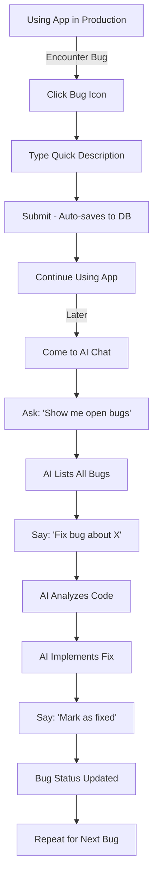

# 🐛 Bug Reporting Feature - START HERE

## ✅ Status: COMPLETE & READY TO USE

Your bug reporting feature is fully implemented, tested, and ready to use in production!

## 🎯 Quick Start

### 1. Test the Feature
1. Run your dev server: `npm run dev`
2. Look for the **bug icon** (🐛) in the top right navigation bar
3. Click it to open the bug report modal
4. Type a test bug: "Testing the bug reporting feature"
5. Press Submit (or ⌘ Enter)
6. Check your Supabase dashboard → `bugs` table to see it saved

### 2. Report Real Bugs
When you encounter a bug while using the app:
- Click the bug icon
- Describe what went wrong (just a quick blurb)
- Submit
- Continue working

The system automatically captures:
- What you typed (description)
- Current URL (what page you were on)
- Browser info (your device/browser)
- Timestamp (when it happened)

### 3. Review and Fix Bugs Later
Come back to this AI chat and say:
```
"Can you summarize open bugs?"
```

I'll query your database and show you all the bugs. Then you can ask:
```
"Can you fix the bug about [topic]?"
```

And I'll analyze your code and implement the fix!

## 📚 Documentation

I've created several guides for you:

1. **`BUG_REPORTING_GUIDE.md`** - Complete user guide
   - How to report bugs
   - How to review bugs with AI
   - Database schema
   - Example workflow

2. **`AI_BUG_WORKFLOW_EXAMPLES.md`** - AI interaction examples
   - Exact phrases to use when talking to me
   - Query examples
   - Fix examples
   - Status update examples
   - Complete workflow examples

3. **`IMPLEMENTATION_SUMMARY.md`** - Technical details
   - What was built
   - How it works
   - Files created/modified
   - Architecture details

## 🏗️ What Was Built

### Database
- ✅ `bugs` table created in Supabase
- ✅ Migration applied successfully
- ✅ RLS enabled for security
- ✅ Indexes for performance

### Frontend
- ✅ Bug icon in top navigation
- ✅ Beautiful modal for submitting bugs
- ✅ Keyboard shortcuts (⌘ Enter to submit)
- ✅ Auto-capture of URL and browser info
- ✅ Loading states and error handling

### Backend/API
- ✅ `submitBug()` - Create new bug
- ✅ `fetchBugs()` - Get all/filtered bugs
- ✅ `updateBugStatus()` - Update bug status
- ✅ `deleteBug()` - Delete a bug
- ✅ Full TypeScript types

### AI Integration
- ✅ I have access via Supabase MCP
- ✅ Can query bugs
- ✅ Can update bug status
- ✅ Can analyze and fix issues
- ✅ Can read your entire codebase for context

## 🧪 Build Status
✅ **Build successful** - No compilation errors
✅ **No linter errors** - Code is clean
✅ **Types correct** - Full TypeScript support
✅ **Database verified** - Table exists and is ready

## 💬 Try It Now!

You can test the AI integration right now by asking me:

**"Show me the structure of the bugs table"**

Or after you report a test bug:

**"Can you show me all bugs in the database?"**

## 🔄 Typical Workflow



## 🎨 UI Preview

The bug icon looks like this in your top nav:
```
[☰ Menu]  [Geronimo]                    [🐛] [Your Timer/Other Icons]
```

Clicking it opens a sleek modal:
```
┌─────────────────────────────────────────┐
│ 🐛 Report a Bug                     ✕  │
├─────────────────────────────────────────┤
│ Describe the bug briefly...            │
│                                         │
│ ┌─────────────────────────────────────┐│
│ │ [Your description here...]          ││
│ │                                     ││
│ │                                     ││
│ └─────────────────────────────────────┘│
│                                         │
│ Tip: Include what you were doing...    │
│ Press ⌘ Enter to submit.               │
│                                         │
│                    [Cancel] [Submit]    │
└─────────────────────────────────────────┘
```

## 🚀 Next Steps

1. **Test it out** - Report a test bug via the UI
2. **Talk to me** - Ask me to show you the bug
3. **Try a fix** - Let me fix a simple issue for you
4. **Use in production** - Start capturing real bugs as you work

## 📞 Getting Help

Just ask me questions like:
- "How do I mark a bug as fixed?"
- "Can you show me all bugs from last week?"
- "How do I delete old bugs?"
- "Can you explain the database schema?"

I have full access to:
- Your bugs table (via Supabase MCP)
- Your entire codebase (to fix issues)
- All documentation (to explain things)

## 🎉 You're All Set!

The bug reporting feature is **production-ready**. Start using it to capture bugs, and come back to this chat whenever you want to review and fix them!

---

**Quick Reference:**
- UI: Click bug icon (🐛) in top nav
- Database: `bugs` table in Supabase
- AI: Just ask me to "show bugs" or "fix bugs"
- Docs: See the 3 guides mentioned above

Happy bug hunting! 🐛✨
